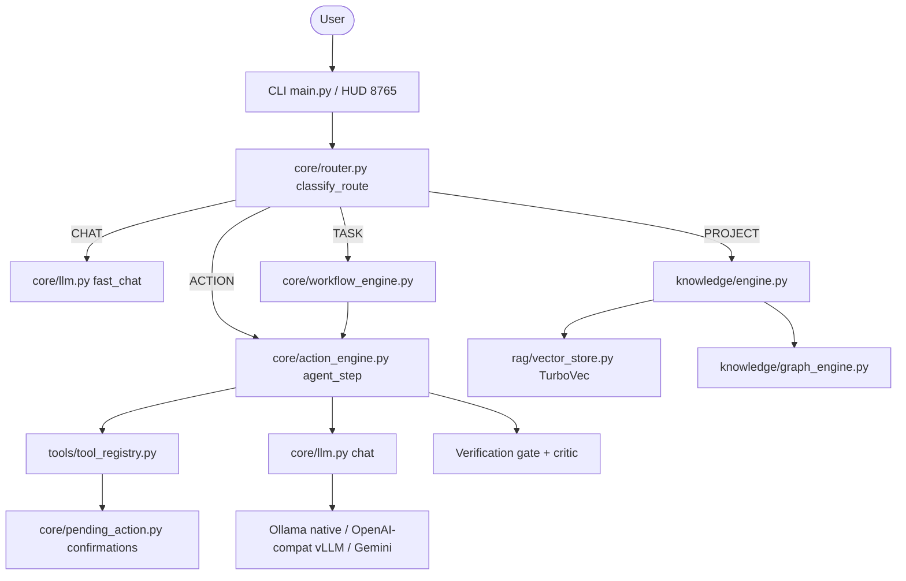

# Immortility Audit (Phase 0)

Date: 2026-08-18
Scope: read-only inspection of the existing repository before any architectural change.
Target machine: RTX 4060 laptop, 8 GB VRAM, Ryzen 7000-series, Windows.

Note on naming: the package/repo is spelled `immortility`, the product is spoken as
"Immortality". Code keeps `immortility` (module paths, env prefix `IMMORTILITY_`).
Only these design documents use the `IMMORTALITY_` filenames.

---

## 1. What Immortility is today

A local-first Windows assistant with two front ends (Rich CLI in `main.py`, and a
stdlib-HTTP HUD on port 8765) sharing one agent core. It is a modular monolith with
no external orchestration framework — no LangChain, no LangGraph. The router, tool
loop, retrieval store, and verification gate are all first-party code.



### Runtime and model reality (measured from config, not aspiration)

| Concern | Actual state |
| --- | --- |
| Chat runtime | `core/llm.py` speaks Ollama native `/api/chat` (think=false) and any OpenAI-compatible `/v1`; Gemini path exists but `GEMINI_API_KEY` is empty |
| Active brain | Ollama `qwythos9b-q4` (Qwythos-9B Q4_K_M GGUF) via `scripts/ollama/Modelfile.qwythos9b-q4` |
| Context | `num_ctx 8192` in the Modelfile. The advertised 1M context is not usable on 8 GB |
| Fallback | `IMMORTILITY_FALLBACK_MODEL`, currently `qwen3:8b` |
| vLLM | `scripts/wsl/` exists and works, but the WSL server is not running day to day |
| Embeddings | `BAAI/bge-small-en-v1.5`, 384-d, sentence-transformers, `rag/embeddings.py` |
| Reranker | `BAAI/bge-reranker-base` CrossEncoder, CPU, disabled (`RERANK_ENABLED=0`) |
| STT | faster-whisper `small.en`, CPU by default (`WHISPER_DEVICE=cpu`) |
| TTS | pyttsx3 / Windows SAPI, with barge-in |
| Vision | none |
| OCR / image gen | none |

---

## 2. Strengths worth preserving

1. **Working autonomous tool loop.** `core/action_engine.py` runs a JSON tool loop with
   step caps (`action_max_steps_readonly=10`, `action_max_steps_edit=20`), no-progress
   detection, repeated-identical-edit detection, evidence collection, a verification
   gate, and a forced summary path when a small local model never emits `DONE`.
2. **Confirmation discipline.** `core/pending_action.py` plus `resume_confirmed_pending()`
   gate mutating tools (including `run_command`). The HUD injects the executed tool
   result back into the loop, which is what fixed the earlier "confirm the same command
   forever" bug. Tests live in `tests/test_hud_safety.py`.
3. **Broad tool surface already registered.** `tools/tool_registry.py` registers ~40 tools:
   filesystem (including `edit_file`, `replace_lines`, `apply_patch`, `rename_symbol`),
   terminal, process control, browser/Playwright, scraping, symbol and code-graph queries.
4. **Real retrieval.** TurboVec vector store (`rag/vector_store.py`) with hybrid BM25 +
   semantic search (`rag/hybrid_search.py`), AST-aware chunking, incremental index state
   (`rag/index_state_db.py`), and a code graph. Roughly 14k chunks indexed for the
   Desktop projects.
5. **Memory layers exist in some form.** `memory/` has conversation, session, project,
   preference, experience, and outcome memory; `knowledge/hierarchical_memory.py` adds a
   tiered view. Learning is already treated as data (scored outcomes), not policy.
6. **Editing safety net.** `editing/` has patch generation, patch validation, syntax
   checks, a diff logger, reflection retry, and a CI gate.
7. **Observability primitives.** `tools/hud_vitals.py` samples CPU/RAM and GPU/VRAM via
   `nvidia-smi`; `core/llm.py` records per-call latency into HUD state; events log via
   `core/repo_paths.events_log_path()`.
8. **Config already env-driven.** `core/config.py` centralises ~20 knobs, so behaviour
   can be tuned without code edits.

---

## 3. Weaknesses, gaps, and duplication

### 3.1 Model layer (the reason Phase 1 exists)

- Model identity is a bare env string resolved in three places: `local_model()`,
  `_fallback_model()`, and `_detect_fallback_model()` in `core/action_engine.py`.
- There is no notion of a model **role** or **capability**. Nothing in the codebase can
  answer "which model should handle a screenshot" or "which model handles code".
- There is no VRAM-aware admission control. `tools/hud_vitals.py` reads VRAM only to
  paint the HUD; the LLM path never consults it.
- No health probe. A missing Ollama tag surfaces as a raw runtime error mid-task.
- Runtime knowledge leaks: callers pass `force_provider="local"` and read `_provider()`,
  a private function, from `core/action_engine.py`.

### 3.2 Missing subsystems relative to the master prompt

| Area | Status |
| --- | --- |
| Vision / multimodal (Qwen3-VL) | missing |
| OCR (PaddleOCR) | missing |
| PDF / DOCX / XLSX / PPTX / CSV pipelines | shipped in 2B — `extract_document` uses PyMuPDF / python-docx / python-pptx / openpyxl / csv (not a document agent) |
| Video (FFmpeg + frame sampling) | missing |
| Image generation (FLUX) | missing |
| MCP client/manager | missing (`tests/audit_report.py` already reports this) |
| Git as first-class tools | shipped in 2B — `git_*` primitives via Tool Kernel → `CommandTool` (not a Git agent) |
| Database tools (Postgres/MySQL/SQLite/Mongo/Redis) | partial — 2B ships **configured** SQLite / PostgreSQL / MongoDB only. No MySQL, no Redis, no arbitrary URLs |
| Docker / DevOps tools | partial — 2B ships read-first inspect (`ps`/`images`/`inspect`/`logs`/`info`); `docker_rm` is destructive and never silent |
| Computer control (mouse/keyboard/window) | partial — `tools/system_control.py`, no vision loop |
| Skill registry / loader / matcher | missing — `skills/` holds one hardcoded LeetCode skill |
| Hook system | missing — `core/event_bus.py` exists but is not an agent lifecycle hook bus |
| Rules system | missing — prompts are static files in `prompts/` |
| Permission modes (SAFE/ASSISTED/AUTONOMOUS/DEVELOPER) | shipped in Phase 4 — `core/permissions.py`; default ASSISTED (per-tool confirm). Destructive git is never silent. |
| Security scanners (AgentShield-style) | missing |
| Evaluation harness | partial — `tests/audit_report.py` is a phase smoke runner, not a benchmark |
| Session resume / handoff | shipped in Phase 4 — `memory/session_resume.py` (`/resume`, `/handoff`). Stale tool confirmations stay cleared on startup. |

### 3.3 Duplication and drift

- **VRAM probing** will be duplicated the moment the model layer needs it; the
  `nvidia-smi` call currently lives only inside `tools/hud_vitals.py`.
- **Fallback logic** is duplicated between `core/llm.py::_fallback_model` and
  `core/action_engine.py::_detect_fallback_model`.
- **Two verifiers** exist: `core/verifier.py` and `editing/verifier.py`.
- **`immortility_architecture.md` is stale** — it still shows ChromaDB and `qwen3:8b`
  as the runtime, both of which are wrong (TurboVec, Qwythos).
- **`agents/` is not an agent system.** `research_agent.py`, `research_synth.py`, and
  `memory_agent.py` are helper modules, not scoped workers with their own prompts,
  tools, and review boundaries.

### 3.4 Honest capability caveats

- No component can currently interpret an image, so any claim of "screenshot analysis"
  would be false. Phase 1 makes this explicit rather than silently degrading.
- Whisper on CUDA and a Q4 9B chat model do not comfortably co-exist in 8 GB; the
  default keeps Whisper on CPU.
- Switching embeddings to BGE-M3 (1024-d) invalidates every existing TurboVec vector.
  That is a reindex of roughly 14k chunks and must be its own phase.

---

## 4. Hardware policy for all later phases

8 GB VRAM is the binding constraint. The rules the model layer enforces:

1. **One heavy model resident at a time.** A heavy model is any chat/vision model over
   roughly 3 GB of weights. Loading a second heavy role evicts the first.
2. **Embeddings stay small and CPU-friendly.** BGE-small is ~130 MB and can share the
   machine with the chat model.
3. **Whisper stays on CPU** unless the operator explicitly opts into CUDA.
4. **Context is configurable and modest.** 8192 default, 16384 opt-in. 32k+ is expected
   to OOM alongside KV cache on this card and is not offered as a default.
5. **A missing specialist is a warning, never a crash.** If the coder or vision model is
   absent, the router falls back to the brain (for text) or reports the capability as
   unavailable (for vision).
6. **No implicit downloads.** Nothing in the runtime path may trigger `ollama pull` of a
   multi-gigabyte model.

### Fleet as configured now

| Role | Registry id | Default today | 8 GB reality |
| --- | --- | --- | --- |
| Brain | `brain` | Ollama `qwythos9b-q4` (env can override) | Resident; ctx 8k default, 16k opt-in |
| Code | `code` | aliases the brain | Optional smaller coder via `OLLAMA_CODE_MODEL`; Qwen3-Coder-30B-A3B is registered but gated above 8 GB |
| Vision | `vision` | none | Optional lazy via `OLLAMA_VISION_MODEL`; evicts the brain when used |
| Embed | `embed` | `BAAI/bge-small-en-v1.5` | Keep. BGE-M3 is a later phase because it forces a reindex |
| Rerank | `rerank` | `BAAI/bge-reranker-base` | CPU, stays disabled by default |
| ASR | `asr` | Whisper `small.en` | CPU default |
| TTS | `tts` | pyttsx3 / SAPI | Works offline; Kokoro is optional later |

---

## 5. ECC as inspiration, not a dependency

`affaan-m/ECC` is a harness-optimisation system for Claude Code and similar hosts:
agents, on-demand skills, hooks, rules, memory/instincts, and an AgentShield security
scanner. Its vendor-specific parts (Claude Code plugin manifests, `.claude/` layout,
slash-command shims, `hooks.json` event names) do not transfer to Immortility, which
owns its own loop and runtime.

What is worth porting natively, and where it would live:

| ECC concept | Immortility equivalent | Phase |
| --- | --- | --- |
| Skills as the primary workflow surface, loaded on demand | `skills/registry.py` + `prompts/rules/*.md`, injected into planner/coder notes when matched | **3 (shipped)** |
| Agents as scoped workers | thin role labels on `run_coding_loop` (planner / coder / reviewer / debugger / executor / reflector), not new frameworks | **3 (shipped)** |
| Plan to implement to review to verify | LLM planner + heuristic fallback, then coder, fresh-context review, allowlisted checks | **3 (shipped)** |
| Fresh-context review | `core/coding_reviewer.py` — new message list, never the coder conversation | **3 (shipped)** |
| Build-fix loop | bounded retries in `run_coding_loop` (`IMMORTILITY_MAX_RETRIES`) | **3 (shipped)** |
| Instincts / continuous learning | already partly present as `memory/outcome_memory.py` and `memory/experience_memory.py`; keep learned items as inspectable data with approve/edit/delete, never auto-promoted to system policy | 6 |
| Context budgeting | `knowledge/smart_context_builder.py` gains explicit token budgets and pruning | 6 |
| Rules (durable standards) | `prompts/rules/*.md`, loaded by skill match | **3 (shipped)** |
| Hooks (deterministic event handlers) | `core/hooks.py` lifecycle on the coding loop, observed via EventBus + harness traces | **3 (shipped)** |
| AgentShield | `security/` scanners for prompts, config, secrets, MCP, permissions | 8 |

Explicit decision: **ECC is not vendored into this tree.** No `.claude/` directory, no
copied skill markdown, no ECC hook JSON. Concepts are reimplemented against
Immortility's own interfaces so the assistant runs standalone.

---

## 6. Target layout (adapted, not greenfield)

The master prompt proposes an `immortality/` tree. Rebuilding into it would break every
import for no functional gain. The existing layout already maps cleanly; only `models/`
is genuinely new.

```text
immortility1/
├── core/        # router, action engine, config, llm facade, workflow, verifier
├── models/      # NEW: registry, router, manager, vram, doctor  (Phase 1)
├── tools/       # tool registry + implementations + HUD server
├── skills/      # Phase 3: SkillRegistry/Matcher (today: one skill)
├── agents/      # Phase 3-4: scoped roles (today: helpers)
├── knowledge/   # knowledge engine, context builders, graph
├── rag/         # embeddings, chunking, TurboVec store, hybrid search
├── memory/      # conversation/session/project/outcome/experience
├── editing/     # patch generation, validation, self-debug
├── security/    # Phase 8: scanners
├── evaluation/  # Phase 9: benchmark harness
├── config/      # NEW: models.yaml  (Phase 1)
├── prompts/     # system prompts; Phase 3 adds rules/
├── frontend/    # HUD html
├── scripts/     # ollama Modelfiles, wsl vLLM, ingestion
└── tests/
```

---

## 7. Phased migration plan

See [IMMORTALITY_VISION.md](IMMORTALITY_VISION.md) and [IMMORTALITY_PHASES.md](IMMORTALITY_PHASES.md) for the frozen architecture and honest phase status.

Phase 0 (this document) and Phase 1 are shipped. Slices H, K, 2A, and 2B are also shipped. Phase 3 is **complete**. ECC was inspiration only (not vendored). Phase 4 (operational control plane) is **shipped**.

| Phase | Deliverable | State |
| --- | --- | --- |
| 0 | This audit | shipped |
| 1 | `models/` registry, VRAM, doctor | shipped |
| H | Harness foundation (`core/harness.py`) | shipped |
| K | Execution kernel, FAST/AGENT/BACKGROUND, streaming, warm/cold | shipped |
| 2A | Capability card/report, permissions, search states | shipped |
| 2B | Git / documents / Docker inspect / configured DBs / command hardening | shipped |
| 3 | Autonomous coding loop over existing kernels | **complete** — `core/coding_engine.py` plus skills/hooks/planner/fresh reviewer/PROJECT adapter. ECC was inspiration only (not vendored). |
| 4 | Operational control plane (permission modes + session resume/handoff) | **shipped** — not multimodal; VL/OCR stays Phase 5 |
| 5 | Multimodal VL/OCR/video | roadmap |
| 6 | Memory/RAG budgets; BGE-M3 only with full reindex | roadmap |
| 7 | Full eval harness + novel-task generalization | roadmap |
| 8–10 | Training data, LoRA, continuous improve | roadmap |

### Out of scope for the current change

No `ollama pull` of 30B / VL / FLUX weights, no BGE-M3 swap (it would invalidate the
existing index), no Kokoro replacement for SAPI, no MCP, no permission-mode rewrite, and
no restructuring of `core/`, `tools/`, `rag/`, or `knowledge/`.

---

## 8. Phase 1 acceptance criteria

1. HUD and CLI chat still work against the current Qwythos configuration.
2. The Action Engine tool loop, confirmations, and verification gate are unchanged in
   behaviour; existing tests stay green.
3. `python -m models.doctor` reports GPU/VRAM/RAM, config validity, brain reachability,
   fallback, embeddings, ASR, TTS, and rerank status; missing optional specialists are
   warnings.
4. The router can name the model for `chat`, `code`, and `vision` without loading weights.
5. With no vision model configured, the vision capability reports unavailable instead of
   pretending the text brain can see.
