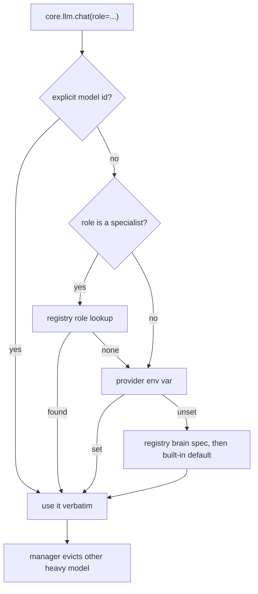

# Immortility Models (Phase 1)

The model layer answers one question: **which model serves this role right now, on
this hardware?** It lives in `models/` and is driven by `config/models.yaml`.

Nothing in this layer downloads weights. A model that is not installed is reported
as unconfigured and skipped.

---

## Roles and the current fleet

| Role | Capability | Default | Status on this laptop |
| --- | --- | --- | --- |
| `brain` | chat, reasoning, planning, tools, code | Ollama `qwythos9b-q4` | active, context 8192 |
| `code` | code | `OLLAMA_CODE_MODEL` if set | unset, degrades to the brain |
| `vision` | vision | `OLLAMA_VISION_MODEL` if set | unset, capability reports unavailable |
| `embed` | embed | `BAAI/bge-small-en-v1.5` (384-d, CPU) | active |
| `rerank` | rerank | `BAAI/bge-reranker-base` (CPU) | off unless `RERANK_ENABLED=1` |
| `asr` | asr | faster-whisper `small.en` (CPU) | active |
| `tts` | tts | pyttsx3 / Windows SAPI | active |

`brain-vllm` and `brain-fallback` are alternate brain specs. A spec is only offered
when its runtime matches the active provider, so an Ollama tag is never sent to a
vLLM endpoint.

---

## VRAM policy (RTX 4060, 8 GB)

- **One heavy model resident.** Anything at or above 3000 MB of weights is heavy.
  Requesting a different heavy role evicts the current one via Ollama's
  `keep_alive: 0` unload before the new model is used.
- **Heavy models are admitted against total VRAM** (eviction makes room), light ones
  against currently free VRAM.
- `coder-large` (Qwen3-Coder-30B-A3B class) is registered with a 19000 MB gate, so it
  is never selected on this card. Set `IMMORTILITY_CODE_LARGE_MODEL` only on a
  machine that can actually host it.
- Embeddings, reranker, and Whisper stay on CPU by default so they never compete
  with the chat model.
- A missing optional specialist is a warning, never a crash.

---

## Resolution order



Environment variables always outrank `config/models.yaml`, so an operator can swap a
model without editing config.

---

## Environment variables

| Variable | Effect |
| --- | --- |
| `IMMORTILITY_LLM_PROVIDER` | `ollama`, `vllm`, `openai`, `gemini`, `auto` |
| `OLLAMA_MODEL` / `VLLM_MODEL` / `OPENAI_MODEL` | brain model id for that runtime |
| `IMMORTILITY_FALLBACK_MODEL` | secondary chat model on the same endpoint |
| `OLLAMA_CODE_MODEL` | enables the `code` specialist |
| `OLLAMA_VISION_MODEL` | enables the `vision` role |
| `IMMORTILITY_CODE_LARGE_MODEL` | registers a 30B-class coder (needs ~19 GB) |
| `IMMORTILITY_NUM_CTX` | explicit context window, clamped to 32768 |
| `RERANK_ENABLED` / `RERANK_MODEL` | retrieval reranker |
| `WHISPER_MODEL` / `WHISPER_DEVICE` | speech-to-text |
| `IMMORTILITY_EMBED_MODEL` | embedding model (changing it invalidates the index) |

---

## Using it from code

```python
from core.llm import chat, role_model, capability_available

chat(messages=msgs)                  # brain (default)
chat(messages=msgs, role="code")     # coding specialist, or brain if absent
role_model("vision")                 # "" when no vision model is installed
capability_available("vision")       # False -> do not claim image understanding
```

Direct access to the layer, when a caller needs the policy rather than a completion:

```python
from models.router import select_for_role, describe_roles
from models.manager import get_manager

select_for_role("code")      # Selection(spec, degraded, skipped) or None
get_manager().health(spec)   # ok | unconfigured | disabled | inactive | unavailable
get_manager().unload_all()   # free the resident heavy model
```

---

## Doctor

```powershell
.\venv\Scripts\python.exe -m models.doctor
```

or `/doctor` inside the CLI. It reports GPU/VRAM/RAM, config validity, per-spec
health, and the active routing table. Exit code 1 means a *required* component is
broken; warnings are optional capabilities.

`[--]` marks a spec that is configured but belongs to an inactive runtime (for
example the vLLM brain while Ollama is the provider). That is normal.

---

## Context notes

- `config/models.yaml` sets 8192 for the brain. `IMMORTILITY_NUM_CTX` raises it and is
  clamped at 32768, but 16384 is the highest value tested on 8 GB.
- On Ollama the override is sent per request as `num_ctx`, which forces one model
  reload the first time it differs from the Modelfile value in
  `scripts/ollama/Modelfile.qwythos9b-q4`.
- The advertised 1M context of Qwythos is not usable on this card and is not offered.

---

## Known limitations

- Vision, OCR, PDF/Excel/video pipelines, and MCP are not implemented in this phase;
  see `IMMORTALITY_AUDIT.md` for where they land.
- The manager does not pre-warm weights. The inference server loads them on the first
  request; the manager only makes room and reports health.
- Eviction is implemented for Ollama. For vLLM the served model is fixed at server
  start, so switching heavy models there means restarting the server.
- Swapping the embedding model requires a full reindex of TurboVec, which is why
  BGE-M3 is deferred to a later phase.
