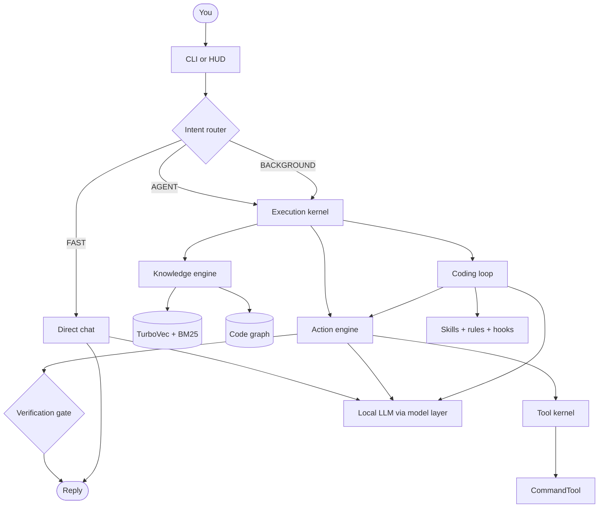

# Immortility

Local-first AI assistant for your PC. You talk in natural language; it plans, uses tools, edits code, verifies the result, and remembers your projects. The **system** is the product — not a chatbot wrapper around a cloud model.

Two front ends, one core: Rich CLI (`main.py`) and a JARVIS-style HUD in the browser.

## Why it’s different

- **Runs on your machine.** Your files, terminal, git, and projects stay local. No cloud coding agent required.
- **It actually does the work.** Chat, file edits, commands, git, docs, Docker inspect, and named databases go through one tool loop with confirmations and a verification gate — not “here’s a snippet, you paste it.”
- **Coding is a real loop, not a one-shot patch.** Planner → inspect → coder → fresh-context reviewer → allowlisted tests/`py_compile` → reflect. Simple edits stay cheap; bigger tasks get a plan. Destructive git never runs silently.
- **It knows your repos.** `/open` indexes a project into TurboVec (hybrid BM25 + semantic search) plus an optional code graph, then retrieves the slices that matter.
- **Honest about hardware.** One heavy model at a time on 8 GB VRAM. Missing vision is reported as unavailable — it does not pretend to see.
- **Skills and rules, not a swarm of hidden agents.** Small on-demand skills and durable rules (`prompts/rules/`) plus deterministic hooks. Policy stays in files, not buried in prompts.

## What it can do

| Area | Capabilities |
|------|----------------|
| Chat | Fast Q&A vs full agent loop (FAST / AGENT / BACKGROUND) |
| Coding | Multi-file edits, inspect-first, review, pytest / syntax checks, bounded retries |
| Projects | Index, retrieve, graph, import docs into a separate collection |
| Tools | Filesystem, terminal, git, Docker inspect, PDF/DOCX/PPTX/XLSX/CSV, Playwright web |
| Data | Named SQLite / Postgres / Mongo only (no arbitrary URLs from the model) |
| Voice | Offline mic → local Whisper → local LLM → Windows male TTS, with barge-in (`stop`) |
| Ops | `/doctor` model fleet check, `/capabilities` (deterministic, not LLM memory) |

**Not yet:** vision / OCR / video / audio understanding, BGE-M3 reindex, full eval harness, LoRA training. Those are later phases.

## Architecture

One modular monolith. No LangChain / LangGraph. Router, tools, retrieval, coding loop, and verification are first-party.

```
CLI / HUD
    → Intent router (CHAT / ACTION / PROJECT / TASK)
        → FAST | AGENT | BACKGROUND  (execution kernel)
            → Knowledge  (TurboVec hybrid search + code graph)
            → Action engine  (tool loop + confirmations + verification gate)
            → Coding loop    (plan → inspect → code → review → check → reflect)
            → Skills / rules / hooks  (on demand, not a second agent framework)
    → Model layer  (role: brain / code / vision / embed / asr / tts)
    → Local LLM    (Ollama, or any OpenAI-compatible /v1 server)
```



**Coding loop:** heuristic/LLM planner → inspect (`git status`; skip extra discovery on simple edits) → coder (tools + confirmations) → fresh-context reviewer → allowlisted `pytest` / `py_compile` → reflect. Review failure skips tests and retries the coder. Success needs **both** review and checks. Destructive git is never silent.

**Tools** are primitives, not per-task agents. Git, Docker inspect, `run_command`, documents, and named databases share one command engine (timeout, cwd, cancel, traces). Mutating git asks first; force-push / `reset --hard` / branch delete need an extra destructive confirm.

**Models** are chosen per role and VRAM: one heavy model resident on 8 GB. `/doctor` reports what is actually loaded. Vision is off unless you set a vision model.

## Requirements

- Windows, Python 3.11+
- [Ollama](https://ollama.com) (or any other OpenAI-compatible `/v1` server)
- Optional: Playwright browsers (`playwright install`)

## Setup

```powershell
cd immortility1
python -m venv venv
.\venv\Scripts\Activate.ps1
pip install -r requirements.txt
copy .env.example .env
```

Create the local brain in Ollama (8 GB VRAM — keep context modest):

```powershell
ollama pull hf.co/empero-ai/Qwythos-9B-Claude-Mythos-5-1M-GGUF:Q4_K_M
ollama create qwythos9b-q4 -f scripts/ollama/Modelfile.qwythos9b-q4
```

In `.env`:

```
IMMORTILITY_LLM_PROVIDER=ollama
OLLAMA_MODEL=qwythos9b-q4
IMMORTILITY_FALLBACK_MODEL=qwen3:8b
```

Then:

```powershell
.\venv\Scripts\python.exe main.py
# or
.\run.ps1
```

`/hud` opens the HUD. `/open <path>` indexes a project. `/talk` is continuous voice. `/doctor` checks the model fleet.

After upgrading from Chroma: TurboVec cannot read old files — run `/open` again (or `scripts/ingest_projects.py`).

## Commands

| Command | Purpose |
|---------|---------|
| `/open <path>` | Index a project |
| `/projects` | Remembered projects |
| `/memory` | Knowledge engine stats |
| `/import-docs <name> <path>` | Import documentation |
| `/hud` | Open the HUD |
| `/doctor` / `/models` | GPU, config, routing health |
| `/capabilities` | What is actually available |
| `/talk` `/voice` | Continuous speech-to-speech |
| `/listen` | One-shot mic into the text loop |
| `/clear` | Clear conversation / pending state |
| `/exit` | Quit |

## Tests

```powershell
.\venv\Scripts\python.exe -m pytest tests/ -q --ignore=tests/audit_report.py
.\venv\Scripts\python.exe -m models.doctor
```

## More detail

[`IMMORTALITY_AUDIT.md`](IMMORTALITY_AUDIT.md) · [`IMMORTALITY_PHASES.md`](IMMORTALITY_PHASES.md) · [`IMMORTALITY_MODELS.md`](IMMORTALITY_MODELS.md) · [`immortility_architecture.md`](immortility_architecture.md)

Local artifacts stay out of git (`venv/`, `.vector_db/`, `state.json`, `logs/`, …). `.env` is gitignored.
