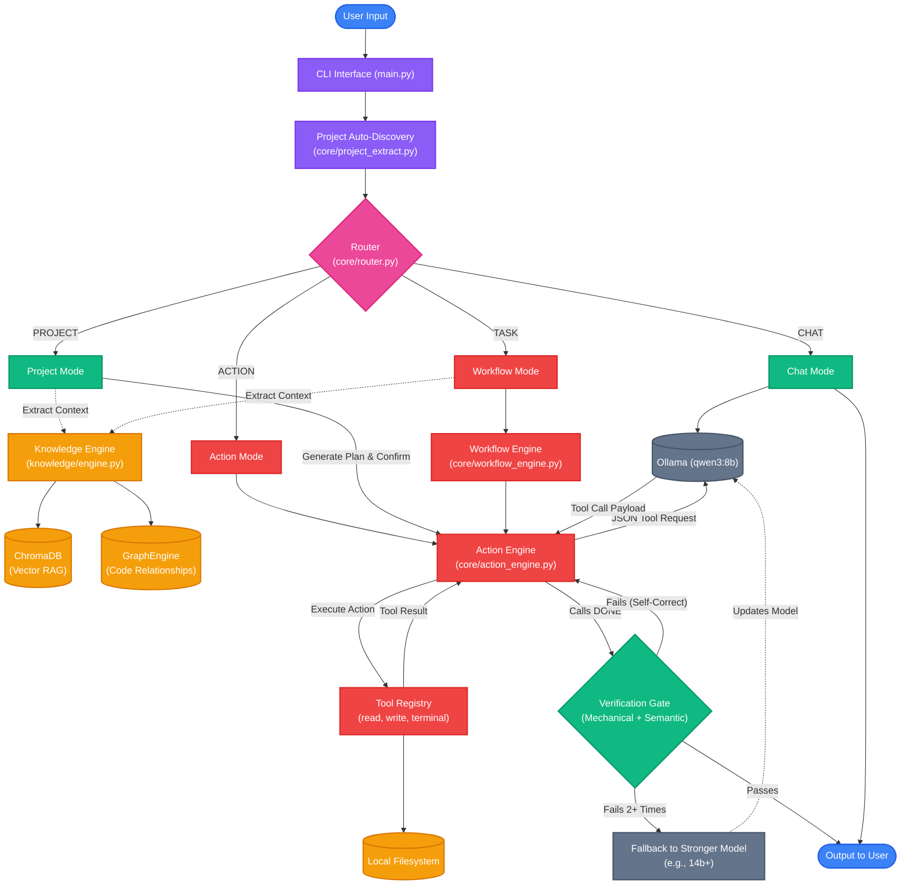

# Immortility System Architecture

Below is a visual flowchart of how data and execution flow through Immortility's core modules, from user input to LLM execution and filesystem edits.

> [!IMPORTANT]
> Parts of the diagram below are historical. The vector store is **TurboVec**, not
> ChromaDB, and the chat model is resolved through the model registry
> (`config/models.yaml`, currently the Qwythos-9B Q4 brain) rather than a hardcoded
> `qwen3:8b`. See [`IMMORTALITY_AUDIT.md`](IMMORTALITY_AUDIT.md),
> [`IMMORTALITY_VISION.md`](IMMORTALITY_VISION.md), and
> [`IMMORTALITY_PHASES.md`](IMMORTALITY_PHASES.md).
>
> Shipped now: FAST/AGENT/BACKGROUND strategies (`core/execution_mode.py`),
> execution kernel (`core/execution_kernel.py`), harness traces (`core/harness.py`),
> deterministic capabilities (`core/capabilities.py`), Phase 2B primitives
> (git / documents / Docker inspect / configured databases) that all share the
> single command execution engine in `tools/command_tool.py`, and Phase 3 slice 3.0
> (`core/coding_engine.py`: Planner→Coder→Executor→Debugger→Reviewer→Reflector
> over those kernels). ECC skills/hooks, fresh-context review, and multimodal
> VL/OCR are **not** shipped.



> [!NOTE] 
> The **Action Engine** forms an autonomous loop with the local LLM. It repeatedly calls tools from the **Tool Registry** (like reading files or running commands). Before completing, it must pass a **Verification Gate** (mechanical checks + semantic review). If it fails repeatedly, it can automatically fallback to a stronger model to self-correct.

## Phase 2B tool ecosystem (shipped)

Git, Docker inspect, document parsers, and configured databases are **primitives** in the Tool Kernel. There is no Git Agent, PDF Agent, Docker Agent, or Database Agent.

```
Tool Kernel (git_status, extract_document, docker_ps, db_query, run_command, …)
        │
        ├─ git_* / docker_* / run_command ──► CommandTool.execute_command
        │                                      (the only subprocess engine:
        │                                       timeout, cwd, limits, cancel, trace)
        ├─ extract_document ──► PyMuPDF / python-docx / python-pptx / openpyxl / csv
        └─ db_* ──► named connections only (config/databases.yaml or env)
```

Git permission model:

- Read-only (`status`, `diff`, `log`, `show`, branch list, `remote`) — no confirmation.
- Mutating (`add`, `commit`, `checkout`/`switch`, `stash` push/pop, `fetch`, non-force `push`, mixed/soft `reset`) — user confirmation via `pending_action`.
- Destructive (`reset --hard`, force-push, branch delete, stash drop/clear, commit `--amend`) — confirmation **and** `confirm_destructive=true`. Never silent.

Repo boundary: cwd must be inside the Immortility repo, the active project, or `IMMORTILITY_GIT_ALLOWED_ROOTS`. `git -C` / `--git-dir` from the model are rejected.

Limitations: no MySQL/Redis tools; Docker write ops besides confirmed `stop`/`rm` are not registered; Postgres/Mongo need drivers + a configured URL; parsers must be installed (`pymupdf`, `python-docx`, `python-pptx`, `openpyxl`).

## Phase 3 slice 3.0 — coding loop (started, not complete)

Thin roles over the existing kernels. Not a new agent framework and not a second shell.

```
Planner (success criteria) → inspect (discover_tools + git_status)
        → Coder (execute_action / Tool Kernel, confirmations intact)
        → Reviewer (git_status / git_diff only)
        → Executor (CommandTool pytest / py_compile allowlist)
        → Reflector (finish / retry debug / stop)
```

Retry budget is `IMMORTILITY_MAX_RETRIES` (same as the decision engine). Destructive git is never issued by this loop. ECC skills, hooks, and fresh-context review are **not** in this slice.
